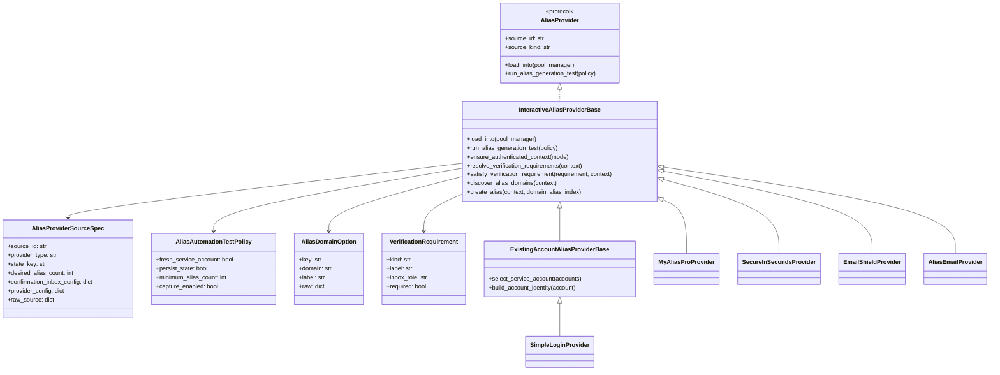

# 已调研别名服务 provider 扩展设计

## 背景

仓库已经完成了一轮以 `vend_email` 为模板的 alias provider 子系统重构，当前具备以下稳定公共边界：

- `core/alias_pool/provider_contracts.py` 中的 `AliasProvider`
- `core/alias_pool/provider_registry.py` 中的 `AliasProviderRegistry`
- `core/alias_pool/provider_bootstrap.py` 中的 `AliasProviderBootstrap`
- `core/alias_pool/automation_test.py` 中的 `AliasAutomationTestService`
- `api/config.py` 与 `frontend/src/lib/aliasGenerationTest.ts` 中的 alias-test 前后端合同

这一轮重构已经把 vend 从“特例站点逻辑”整理成了“可接入统一 provider 子系统的首个真实站点型实现”。但新的需求不再只是继续扩展 vend，而是要把 `docs/superpowers/alias-services/` 下已经完成浏览器研究的多个站点，纳入同一套可扩展架构中。

本次需求明确包含：

1. `simplelogin.io` 要接入，但只走 **existing-account** 路径，不做自动注册。
2. `simplelogin.io` 的随机域名策略中，域名列表不能写死在配置中，而必须优先来自 **服务端接口 / 认证后站点返回的数据**。
3. `manyme.com` 不实现为 provider。
4. 除 `manyme.com` 外，研究文档中的其他站点都需要被纳入本轮扩展设计的实现范围。

## 本次设计的输入证据

### 1. 当前 provider 子系统现状

代码侧当前 provider 类型只覆盖：

- `static_list`
- `simple_generator`
- `vend_email`

对应证据：

- `core/alias_pool/automation_test.py`
- `core/alias_pool/config.py`
- `frontend/src/lib/aliasGenerationTest.ts`

当前系统还没有：

- 多站点 browser-backed provider family 的共用内核
- provider-neutral 的 domain discovery 合同
- provider-neutral 的 verification gate 模型
- 前端“已有服务账号列表”的配置与选择入口

### 2. 已调研站点结论

研究文档与总览文档表明：

- `myalias.pro`：可自动化；路径是 **register -> verify email -> login -> create alias**。
- `alias.secureinseconds.com`：可自动化；路径是 **register -> login -> verify forwarding email -> create alias**。
- `emailshield.app`：可自动化；路径是 **register -> login -> verify email gate -> create alias**。
- `simplelogin.io`：条件可自动化；**公开注册被 captcha 阻挡**，但 **已有账号登录 + alias create** 可行。
- `alias.email`：可自动化，但属于 **magic-link / passwordless** 路径，不是经典 credentials signup/login。
- `manyme.com`：仍被 captcha 阻挡，不纳入本轮 provider 实现范围。

对应文档：

- `docs/superpowers/alias-services/2026-04-19-myalias-pro-automation-research.md`
- `docs/superpowers/alias-services/2026-04-19-secureinseconds-automation-research.md`
- `docs/superpowers/alias-services/2026-04-19-emailshield-automation-research.md`
- `docs/superpowers/alias-services/2026-04-19-simplelogin-automation-research.md`
- `docs/superpowers/alias-services/2026-04-19-alias-email-automation-research.md`
- `docs/superpowers/alias-services/2026-04-19-alias-service-automation-overview.md`

### 3. 本次会话中的额外现场结论

本次会话对 SimpleLogin 做了重新复现，并拿到了比研究文档更强的现场证据。

#### 3.1 访问与登录路径

本次会话先后验证了：

- `https://simplelogin.io/` 可访问
- `https://app.simplelogin.io/auth/login` 可直接访问
- 使用账号 `fust@fst.cxwsss.online / fust@fst.cxwsss.online` 能直接从 `/auth/login` 登录到 `/dashboard/`

对应现场证据文件：

- `simplelogin-home-snapshot.md`
- `simplelogin-login-snapshot.md`
- `simplelogin-login-flow-requests.txt`

这意味着：

1. 当前环境下，`/auth/login` 直连是可行的；
2. 之前研究文档里“优先从主站跳到 app”仍可作为回退策略，但不再是唯一可行路径；
3. SimpleLogin provider 的实现应优先尝试直连 `https://app.simplelogin.io/auth/login`，失败后再回退到主站跳转路径。

#### 3.2 app 子域稳定性

本次复现也确认了 app 子域资源存在不稳定性。在进入 `https://app.simplelogin.io/auth/register` 时，大量 `app.simplelogin.io/static/...` 资源出现了 `net::ERR_CONNECTION_CLOSED`，但这并没有阻止登录页与 dashboard 在后续重试中正常工作。

对应证据文件：

- `simplelogin-register-requests.txt`

因此，当前更准确的结论不是“SimpleLogin 无法进入 app”，而是：

- `app.simplelogin.io` 存在静态资源层面的间歇性不稳定；
- 但登录与 custom alias 主路径在当前会话中仍然实际跑通。

#### 3.3 域名来源的现场证据

本次会话成功进入：

- `https://app.simplelogin.io/dashboard/custom_alias`

并直接读取到了 custom alias 页面中的域名下拉框。对应 DOM 证据表明：

- 域名选择框是一个 `select`
- 字段名为 `signed-alias-suffix`
- 每个选项的 value **不是裸域名字符串**，而是带有服务端签名的 suffix token

对应证据文件：

- `simplelogin-custom-alias-snapshot.md`
- `simplelogin-custom-alias-dom.json`

现场读取到的可选域名包括：

- `@simplelogin.com`
- `@aleeas.com`
- `@8alias.com`
- `@slmails.com`
- `@silomails.com`
- `@8shield.net`
- `@dralias.com`
- `@slmail.me`
- `@simplelogin.fr`

更重要的是，选项 value 形态类似：

- `.relearn763@aleeas.com.aeSMmw.cVxe2e9tMg2IiC2wXAO7CLb-8Bk`

这说明 provider 运行时真正要消费的不是“domain = aleeas.com”这种裸值，而是 **登录后 custom alias 页面或其等价 bootstrap 数据中返回的 signed domain option**。

#### 3.4 非默认域名 alias 创建成功

本次会话没有停在“只看到域名列表”，而是实际选择了非默认域名 `aleeas.com` 对应的 signed option，并成功创建出：

- `sisyrun0419a.relearn763@aleeas.com`

对应证据文件：

- `simplelogin-created-alias-body.json`
- `simplelogin-created-alias-snapshot.md`

这进一步确认：

1. custom alias 页面中的 domain options 是可提交的真实运行时数据；
2. provider 的随机域名策略必须针对 **signed option 集合** 进行随机选择，而不是只对裸域名字符串随机；
3. 本轮设计不应再把 SimpleLogin 的域名来源描述成“仅仅来自某个普通 domain list 接口”，而应表述为：
   - **来自登录后 custom alias 页面或其等价 bootstrap 响应中的 signed domain options**。

## 目标

本次设计目标如下：

1. 在当前 alias provider 子系统之上，扩展出一套能够承载多个真实 alias service 的 provider 架构。
2. 支持三类站点路径：
   - register-first credentials
   - existing-account credentials
   - magic-link / passwordless
3. 保持 `AliasProvider` 顶层公共合同稳定，不把整个系统重构成重量级插件平台。
4. 把 `myalias.pro`、`secureinseconds`、`emailshield`、`simplelogin`、`alias.email` 纳入设计范围。
5. 把 `manyme.com` 明确排除在 registry 与前端 source type 之外。
6. 让 alias-test 继续作为统一的 provider 自动化认证 / 回归入口，并能对这些 provider 返回结构化阶段、失败和账号信息。
7. 保证前端仍能用“同一个服务账号生成 3 个 alias”的结果模型展示测试信息。

## 非目标

本设计明确不做以下事情：

1. 不实现 `manyme.com` provider。
2. 不把仓库改造成跨仓库动态插件发现系统。
3. 不在本轮中统一所有站点的注册 / 登录请求体合同。
4. 不把“默认密码等于邮箱”提升为通用 provider 合同；这只是某些站点的 provider-specific 运营规则。
5. 不把“随机选域名”提升为全局 provider 规则；这只允许由 provider 自己决定。
6. 不因为支持多 provider，就推翻现有 `AliasAutomationTestResult` / `AliasLeaseConsumer` 主路径。

## 推荐总体方案

### 总体结论

保留当前 `AliasProvider` 顶层接口、registry、bootstrap、automation-test 结构不变；在此之下增加一层 **interactive web alias provider family**，用于复用真实站点型 provider 的共性，但不把 `existing-account` 变成整个架构的中心。

换句话说，本次推荐的结构不是：

- 让所有 provider 都围绕 `ExistingAccountProviderBase` 设计

而是：

- 保留统一 `AliasProvider` 顶层合同
- 引入更中性的 `InteractiveAliasProviderBase`
- 在其下按需要增加更窄的 helper，如 `ExistingAccountAliasProviderBase`

这样可以避免 SimpleLogin 的限制性路径污染整个 provider 子系统，同时仍然允许这类站点复用账号选择、登录、状态恢复与 alias 批量生成逻辑。

## 为什么不能把 existing-account 作为中心抽象

虽然 `simplelogin.io` 确实是 existing-account-only 候选，但其他研究站点并不共享同一种主路径：

- `myalias.pro`：注册后必须先验证邮箱，未验证登录会被拒绝。
- `emailshield.app`：凭据登录成功，但 dashboard / alias surface 仍受 verify-email gate 限制。
- `alias.secureinseconds.com`：登录允许先完成，但 alias create 会被 forwarding email verification 卡住。
- `alias.email`：登录本身就是 magic-link，并不依赖 password。

因此，如果把整个设计建立在“已有账号 + 登录 + create alias”这条路径上，会直接对 `alias.email` 与 verify-first 类站点过拟合。

本次设计要求：

1. `existing-account` 只是 provider family 的一个分支；
2. 真正的共享抽象应是：
   - 会话引导
   - verification requirement
   - domain discovery
   - alias create loop
   - state / telemetry / captures

## 候选站点与 provider family 矩阵

| provider_type | 站点 | 本轮状态 | 入口模式 | gate 类型 | 域名来源 | 备注 |
| --- | --- | --- | --- | --- | --- | --- |
| `myalias_pro` | `myalias.pro` | 纳入实现 | register-first credentials | account email verification before login | 固定业务域，允许 provider 内部写死或由站点返回确认 | 登录前 verify |
| `secureinseconds` | `alias.secureinseconds.com` | 纳入实现 | register-first credentials | forwarding email verification before alias create | 固定业务域 | alias create 前 verify forward-to |
| `emailshield` | `emailshield.app` | 纳入实现 | register-first credentials | account verify gate before dashboard / aliases | 当前研究表现为单一业务域 | resend + polling 需要稳定化 |
| `simplelogin` | `simplelogin.io` | 纳入实现 | existing-account credentials only | 不做自动注册；登录后才能继续 | **必须来自登录后 custom alias 页面或等价 bootstrap 响应中的 signed domain options** | 公开注册不纳入实现 |
| `alias_email` | `alias.email` | 纳入实现 | magic-link / passwordless | 登录本身依赖邮件链接 | 通过 `list_domains` / 站点 bootstrap | 非 classic credentials |
| `manyme` | `manyme.com` | 排除 | n/a | captcha-first | n/a | 不实现 |

## 推荐架构

### 顶层公共接口保持不变

继续沿用：

```python
class AliasProvider(Protocol):
    source_id: str
    source_kind: str

    def load_into(self, pool_manager) -> None: ...

    def run_alias_generation_test(
        self,
        policy: AliasAutomationTestPolicy,
    ) -> AliasAutomationTestResult: ...
```

这个边界已经足够稳定：

- `load_into()` 面向真实任务 alias pool
- `run_alias_generation_test()` 面向 alias-test / provider certification / regression

本次不引入第三个 public entrypoint。

### 新增的共享内核：`InteractiveAliasProviderBase`

新增一个偏实现复用的内部骨架，例如：

```python
class InteractiveAliasProviderBase(AliasProvider):
    source_id: str
    source_kind: str

    def load_into(self, pool_manager) -> None: ...
    def run_alias_generation_test(self, policy: AliasAutomationTestPolicy) -> AliasAutomationTestResult: ...

    def ensure_authenticated_context(self, mode: str) -> AuthenticatedProviderContext: ...
    def resolve_verification_requirements(
        self,
        context: AuthenticatedProviderContext,
    ) -> list[VerificationRequirement]: ...
    def satisfy_verification_requirement(
        self,
        requirement: VerificationRequirement,
        context: AuthenticatedProviderContext,
    ) -> AuthenticatedProviderContext: ...
    def discover_alias_domains(
        self,
        context: AuthenticatedProviderContext,
    ) -> list[AliasDomainOption]: ...
    def create_alias(
        self,
        *,
        context: AuthenticatedProviderContext,
        domain: AliasDomainOption | None,
        alias_index: int,
    ) -> AliasCreatedRecord: ...
```

它负责：

1. 统一 stage telemetry 写入
2. 统一 failure shape 归因
3. 统一 alias 批量生成循环
4. 统一 state load/save 入口
5. 在 alias-test 中产出一致的 `AliasAutomationTestResult`

它**不**负责：

1. 站点特有的注册 / 登录算法
2. 站点特有的邮件验证语义
3. 站点特有的域名选择策略
4. 站点特有的 alias create payload

### 窄复用 helper：`ExistingAccountAliasProviderBase`

`ExistingAccountAliasProviderBase` 不是整个架构中心，而是 `InteractiveAliasProviderBase` 下面的一个窄 helper，专门服务于：

- 系统不负责新建服务账号
- 输入是一组已有账号
- provider 需要先从账号池里选一组账号
- 然后凭据登录并创建 aliases

它负责的复用点：

1. 从 `accounts[]` 中选账号
2. 在 `account.password` 缺省时，让 provider 自己决定 fallback
3. 统一把 service account 信息写入 `AliasAccountIdentity`
4. 统一记录 `select_service_account` / `login_submit` 之类的阶段

它不应服务于：

- `alias.email` 的 magic-link 路径
- `myalias.pro` / `emailshield` / `secureinseconds` 的 register-first 路径

### verification 抽象

新增 provider-neutral verification requirement 模型，例如：

```python
@dataclass(frozen=True)
class VerificationRequirement:
    kind: str  # account_email | forwarding_email | magic_link_login
    label: str
    inbox_role: str  # confirmation_inbox | real_mailbox | none
    required: bool = True
```

这样不同站点都能映射成统一结果，而不是每个 provider 都自己发明字段名：

- `myalias.pro`：`account_email`
- `emailshield`：`account_email`
- `secureinseconds`：`forwarding_email`
- `alias.email`：`magic_link_login`
- `simplelogin`：通常无 register-time verification，但仍可能有 session bootstrap stages

### domain discovery 抽象

新增 provider-neutral 的域名发现结果模型，例如：

```python
@dataclass(frozen=True)
class AliasDomainOption:
    key: str
    domain: str
    label: str = ""
    raw: dict[str, Any] = field(default_factory=dict)
```

这个模型不意味着所有 provider 都必须“动态发现域名”，而是让 **支持动态发现的 provider 有一个统一输出形状**。

适用场景：

- `simplelogin`：必须使用
- `alias.email`：建议使用

不需要依赖它的场景：

- `myalias.pro`
- `secureinseconds`
- `emailshield`

## `AliasProviderSourceSpec` 的演进

当前 `AliasProviderSourceSpec` 仍然带有 vend 痕迹：

- `register_url`
- `alias_domain`
- `alias_domain_id`

这会让后续 provider 面临两个坏选项：

1. 把越来越多的 provider-specific 字段继续塞进 shared contract
2. 把真正有意义的数据都塞进 `raw_source`

两者都不好。

### 推荐的新 shared shape

建议将 `AliasProviderSourceSpec` 逐步演进为：

```python
@dataclass(frozen=True)
class AliasProviderSourceSpec:
    source_id: str
    provider_type: str
    state_key: str = ""
    desired_alias_count: int = 0
    confirmation_inbox_config: dict[str, Any] = field(default_factory=dict)
    provider_config: dict[str, Any] = field(default_factory=dict)
    raw_source: dict[str, Any] = field(default_factory=dict)
```

其中：

- `provider_config` 是 provider-specific 真相源
- `confirmation_inbox_config` 继续承载 mailbox polling / verification 所需公共信息
- `raw_source` 只保留兼容与 debugging 价值，不作为新逻辑主入口

### 兼容迁移要求

过渡期允许：

- `vend_email` builder 从旧字段和 `provider_config` 双读
- config encode/decode 仍向后兼容旧 source shape

但新 provider 禁止继续向 shared spec 顶层新增站点特有字段。

## provider-specific source 配置模型

### 1. `myalias_pro`

建议 source shape：

```json
{
  "id": "myalias-primary",
  "type": "myalias_pro",
  "state_key": "myalias-primary",
  "alias_count": 3,
  "confirmation_inbox": { ... },
  "provider_config": {
    "signup_url": "https://myalias.pro/signup/",
    "login_url": "https://myalias.pro/login/"
  }
}
```

provider 要负责：

1. 注册新账号
2. 轮询 verification mail
3. 打开 verification link
4. 再进行 credentials login
5. 创建 3 个 alias

### 2. `secureinseconds`

建议 source shape：

```json
{
  "id": "secureinseconds-primary",
  "type": "secureinseconds",
  "state_key": "secureinseconds-primary",
  "alias_count": 3,
  "confirmation_inbox": { ... },
  "provider_config": {
    "register_url": "https://alias.secureinseconds.com/auth/register",
    "login_url": "https://alias.secureinseconds.com/auth/signin"
  }
}
```

provider 要负责：

1. 注册
2. 登录
3. 识别 alias create 被 forwarding verification gate 阻断
4. 从 inbox 中消费 forwarding verification link
5. 重试 alias create

### 3. `emailshield`

建议 source shape：

```json
{
  "id": "emailshield-primary",
  "type": "emailshield",
  "state_key": "emailshield-primary",
  "alias_count": 3,
  "confirmation_inbox": { ... },
  "provider_config": {
    "register_url": "https://emailshield.app/accounts/register/",
    "login_url": "https://emailshield.app/accounts/login/"
  }
}
```

provider 要负责：

1. 注册
2. 凭据登录
3. 识别 `/accounts/verify-email/` gate
4. resend / poll verification mail
5. 消费 verification link
6. 进入 aliases surface 并创建 alias

### 4. `simplelogin`

建议 source shape：

```json
{
  "id": "simplelogin-primary",
  "type": "simplelogin",
  "state_key": "simplelogin-primary",
  "alias_count": 3,
  "provider_config": {
    "site_url": "https://simplelogin.io/",
    "accounts": [
      { "email": "fust@fst.cxwsss.online", "label": "fust" },
      { "email": "logon@fst.cxwsss.online", "label": "logon" }
    ]
  }
}
```

这里有几个关键规则：

1. `accounts[]` 是 provider-specific 字段，不进入 shared contract。
2. `password` 可以省略；若缺省，由 `simplelogin` provider 内部回退为 `email` 本身。
3. **禁止**在 source 配置中长期保存 `alias_domains[]` 作为运行时真相源。
4. 域名列表必须来自 **登录后 custom alias 页面或其等价 bootstrap 响应中的 signed domain options**，不能由本地静态配置长期提供。

#### SimpleLogin 的域名发现要求

SimpleLogin provider 的标准步骤必须包括：

1. 选择已有账号
2. 优先直连 `https://app.simplelogin.io/auth/login` 完成登录；若失败，再回退到主站跳转路径
3. 进入 alias create flow
4. 捕获登录后 custom alias 页面或其等价 bootstrap response 中用于填充 domain options 的 signed options
5. 将其归一化为 `AliasDomainOption[]`
6. 每次创建 alias 时，从已发现域名中随机选一个

#### SimpleLogin 的禁止项

以下做法在本设计中明确禁止：

1. 把 `simplelogin.com` / 其他域名数组硬编码在 provider 中
2. 把 `alias_domains[]` 当作最终运行时真相源长期保存在配置中
3. 只提取裸域名字符串，而忽略 custom alias 页面返回的 signed option value
4. 因为研究环境一时拿不到域名发现数据，就退化成单域名固定创建

#### SimpleLogin 的实现回退策略

如果实现阶段暂时无法识别出 custom alias 页面或等价 bootstrap 数据中的 signed domain options，应当：

1. 在 `discover_alias_domains` 阶段返回结构化失败
2. 在 alias-test 中明确显示“域名发现失败，未满足 provider contract”
3. 不得 silently fallback 到写死域名

### 5. `alias_email`

建议 source shape：

```json
{
  "id": "alias-email-primary",
  "type": "alias_email",
  "state_key": "alias-email-primary",
  "alias_count": 3,
  "confirmation_inbox": { ... },
  "provider_config": {
    "login_url": "https://alias.email/users/login/"
  }
}
```

provider 要负责：

1. 使用 mailbox email 触发 magic-link login
2. 轮询 inbox 中的 `Sign In` 邮件
3. 消费 magic-link
4. 读取 dashboard bootstrap RPC，包括 `list_domains`
5. 创建 alias rules

## 类关系（建议）



## alias-test 与前端设计要求

### source type 扩展

前端与后端 source type 联合需要从：

- `static_list`
- `simple_generator`
- `vend_email`

扩展为至少：

- `myalias_pro`
- `secureinseconds`
- `emailshield`
- `simplelogin`
- `alias_email`

涉及位置：

- `frontend/src/lib/aliasGenerationTest.ts`
- `api/config.py`
- `core/alias_pool/config.py`
- `core/alias_pool/automation_test.py`
- `api/tasks.py`

### 设置页 source 编辑能力

设置页需要支持这些 source 的 provider-specific 配置输入，但 UI 不应一开始做成复杂脚手架。推荐最小可用范围：

1. 能添加 / 删除这些 source
2. 能编辑 provider-specific 必需字段
3. `simplelogin` 能编辑 `accounts[]`
4. `simplelogin` 账户项至少支持：
   - `email`
   - `label`（可选）
   - `password`（可选；为空时 provider 内部回退为 email）
5. 不为 `simplelogin` 暴露长期静态 `alias_domains[]` 编辑框

### alias-test 结果展示要求

继续沿用当前 alias-test 的展示要求：

1. 单次测试使用一个服务账号
2. 生成 3 个 alias
3. 表格中服务账号信息只展示一份：
   - 真实邮箱
   - 服务账号邮箱
   - 密码
   - 用户名（如果有）
4. alias 列表中显示 3 个 alias
5. 前端要显示当前阶段与失败原因

这与当前 `frontend/src/lib/aliasGenerationTest.ts` 的 `accountIdentity` / `stages` / `failure` 模型一致，应继续保留并扩展阶段字典，而不是改回平面日志。

### 建议新增的阶段码

建议统一补充以下阶段码：

- `select_service_account`
- `register_submit`
- `login_submit`
- `verify_account_email`
- `verify_forwarding_email`
- `request_magic_link`
- `consume_magic_link`
- `discover_alias_domains`
- `list_aliases`
- `create_aliases`
- `save_state`

这些阶段码要让前端用简短但信息量高的方式展示当前进度与失败点。

## runtime / state / telemetry 设计要求

### state 保存要求

所有 interactive provider 都应具备与 vend 相同等级的 durable state 能力，但不强制共用同一个 state class。要求是：

1. 可保存已选服务账号身份
2. 可保存 session / cookie / local bootstrap state
3. 可保存已发现 domain options（如果 provider 支持）
4. 可保存已生成 alias 摘要
5. 可保存阶段时间线和最后失败原因

### capture summary 要求

interactive provider 应继续复用结构化抓包摘要，而不是只返回文本日志。建议至少捕获：

1. 注册提交
2. 登录提交
3. verification request / verification result
4. domain discovery request
5. alias create request

### 安全边界

保持 vend 已经引入的 URL 安全闸门思路：

1. 邮件中的 verification / magic-link / redirect URL 必须经过安全检查
2. 日志与抓包摘要必须继续脱敏
3. 不能把原始 token / verification code / cookie 写进仓库文档

## provider 注册与 bootstrap 要求

本轮新增 provider 必须同时接入两条路径：

1. **真实任务路径**：`api/tasks.py::_build_alias_pool(...)`
2. **alias-test 路径**：`core/alias_pool/automation_test.py::AliasAutomationTestService._build_default_bootstrap()`

如果只接其中一条，会出现：

- 设置保存后真实运行认识 provider
- 但 alias-test 无法识别 provider

或反过来。

因此，本轮把“新增 provider 必须双注册”视为强约束。

## 实施优先级

虽然本 spec 把所有候选站点都纳入实现范围，但建议实施顺序分 3 波：

### Phase 1：先补共享抽象 + 两个 register-first 凭据 provider

1. 演进 `AliasProviderSourceSpec`
2. 引入 `InteractiveAliasProviderBase`
3. 引入 verification / domain discovery 模型
4. 实现：
   - `myalias_pro`
   - `secureinseconds`

理由：

- 两者路径清晰
- 都是 credentials 为主
- 能先验证 shared interactive skeleton 是否合理

### Phase 2：接入 verify-first 细节更复杂的 provider

1. `emailshield`
2. `simplelogin`

理由：

- `emailshield` 需要稳定 resend / poll 窗口
- `simplelogin` 需要已有账号模型和服务端域名发现

### Phase 3：接入 passwordless provider

1. `alias_email`

理由：

- 它对 shared interactive skeleton 的挑战最大
- 能最终验证“本设计不是围绕 credentials-only 过拟合的”

## 测试要求

### 后端合同测试

至少新增以下测试组：

1. `build_alias_provider_source_specs()` 能正确 decode / normalize 新 provider source
2. registry / bootstrap 能构建 5 个新 provider
3. `InteractiveAliasProviderBase` 的通用 alias loop / stage / failure 逻辑
4. `VerificationRequirement` 在不同 provider 的映射
5. `simplelogin` 的账号选择与 password fallback
6. `simplelogin` 的 domain discovery failure shape
7. `alias_email` 的 magic-link 流程 contract

### alias-test API 测试

至少要覆盖：

1. 新 source type 的 API 请求/响应合同
2. `accountIdentity` 输出仍兼容旧字段
3. 3 个 alias 的返回行为
4. `discover_alias_domains` 等新阶段码能出现在响应中

### 前端合同测试

至少要覆盖：

1. `AliasGenerationSourceType` 扩展后的类型检查
2. 结果展示仍只显示一份服务账号信息
3. alias 列表能显示 3 个 alias
4. 阶段 / failure 显示逻辑支持新阶段码

## 风险与处理

### 风险 1：把 shared contract 再次做成 vend-shaped

处理：

- 严格把 provider 特有字段移动到 `provider_config`
- 新 provider 禁止继续向 `AliasProviderSourceSpec` 顶层加站点字段

### 风险 2：SimpleLogin 再次退化为写死域名

处理：

- 把“域名必须来自登录后 custom alias 页面或等价 bootstrap 响应中的 signed domain options”写成强要求
- 如果 discovery 失败，就结构化失败，不允许 silent fallback

### 风险 3：existing-account helper 反向污染整个 interactive family

处理：

- `ExistingAccountAliasProviderBase` 只能是 `InteractiveAliasProviderBase` 下的窄 helper
- `alias_email` 与 register-first provider 不依赖它

### 风险 4：前端 source 编辑器变成超大配置面板

处理：

- 第一轮仅开放 provider 必需字段
- 不提前做通用低代码表单框架

## 与当前设计的关系

本设计不是替换 `docs/superpowers/specs/2026-04-19-vend-mail-architecture-evolution-design.md`，而是在其基础上向多 provider 站点扩展。两者关系如下：

1. vend 演进设计解决的是“把首个真实站点型 provider 整理成模板”
2. 本设计解决的是“如何把研究完成的其他 alias services 接到同一模板体系里”
3. 本设计默认复用 vend 设计中已经证明有价值的能力：
   - durable state
   - structured captures
   - stage/failure timeline
   - provider-neutral bootstrap
   - URL safety guardrails

## 最终结论

本轮扩展不应围绕 `simplelogin` 单点继续堆特例，而应把系统明确升级成 **多站点 interactive alias provider family**：

- `AliasProvider` 继续作为唯一顶层公共合同
- `InteractiveAliasProviderBase` 成为真实站点型 provider 的共享内核
- `ExistingAccountAliasProviderBase` 只作为 SimpleLogin 类路径的窄 helper
- `VerificationRequirement` 与 `AliasDomainOption` 成为新的 provider-neutral 中层模型
- `simplelogin` 域名选项必须来自登录后 custom alias 页面或等价 bootstrap 响应中的 signed domain options
- `manyme` 明确排除在实现范围之外

这样设计后，仓库才能在不推翻现有 provider 子系统的前提下，稳定容纳：

- register-first provider
- existing-account provider
- magic-link provider

并保持 alias-test、任务链路、状态、前端展示与后续回归的一致性。
